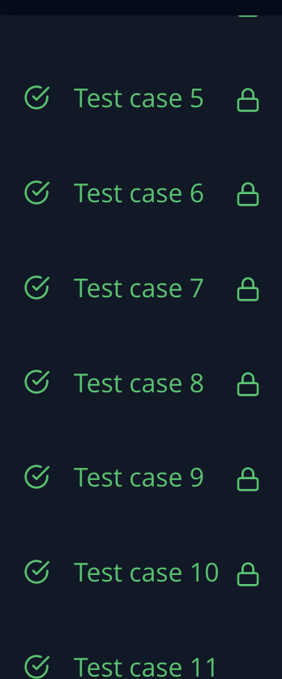

HackerRank Plus Minus

https://www.hackerrank.com/challenges/three-month-preparation-kit-plus-minus/submissions

The solution to this problem was very simple for me. I declared variables for the positive values, negative values, and zero values, and then mapped through the array, keeping track of which category the each element fell into. I made sure to "else" each subsequent if statement so that we aren't running each element through all 3 tests if it is already categorized.

I was particularly proud of this one because I wrote the entire code from beginning to end without running the code, and it compiled and passed all tests in one try.

```
function plusMinus(arr) {
    let positiveValues=0
    let negativeValues=0
    let zeroValues=0
    arr.map(e => {
        if (e > 0){
            positiveValues++
        }else if (e<0) {
            negativeValues++
        }else zeroValues++
    })
    console.log(positiveValues/arr.length)
    console.log(negativeValues/arr.length)
    console.log(zeroValues/arr.length)
}
```

Results:

