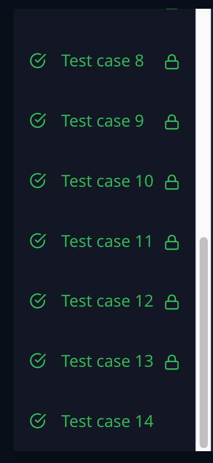

HackerRank Mini-Max Sum

https://www.hackerrank.com/challenges/three-month-preparation-kit-mini-max-sum/problem

For the Mini-Max challenge, I realized that I couldn't manipulate the original array, so I needed to copy it over into a new variable using the spread operator. I realized it would be easier (for me) to sort the array first prior to manipulating it rather than finding the lowest/highest values in the array (since I am more familiar with pop/shift). Once I sorted the array in ascending order, it was as simple as removing the unnecessary element and then summing up the elements.


```
function miniMaxSum(arr) {
    arr.sort((a,b) => {
        return(a-b)
    })
    const minArr = [...arr]
    minArr.pop()
    const maxArr = [...arr]
    maxArr.shift()
    const minSum= minArr.reduce((acc, ele) => acc+ele)
    const maxSum=maxArr.reduce((acc, ele) => acc+ele)
    console.log(minSum, maxSum)

}
```

Results:

