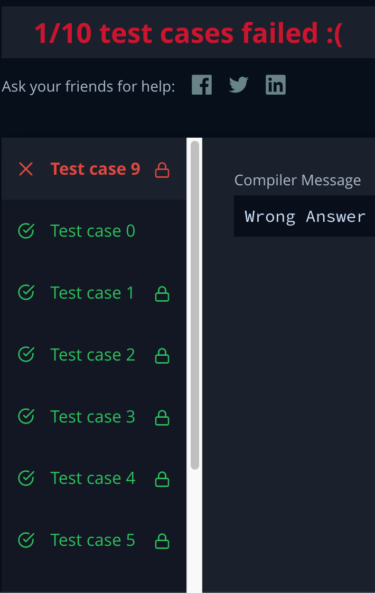

HackerRank Time Conversion

https://www.hackerrank.com/challenges/three-month-preparation-kit-time-conversion/problem?isFullScreen=true


I'm not sure what case I wasn't able to pass.

I found that there are 4 scenarios:

AM and 12 hours
-Change 12 to 00
AM and not 12 hours
-Leave time as is
PM and 12 hours
-Leave time as is
PM and not 12 hours
-Add 12 to the hours to compensate for AM hours


Then I removed "AM"/"PM" from the array and joined it back as a string to return the results in the requested format.


```
function timeConversion(s) {
    let militaryTime = [...s]
    if(militaryTime[8]==="A" && militaryTime[0]==="1" && militaryTime[1]==="2"){
        militaryTime[0]=0
        militaryTime[1]=0
    } else if(militaryTime[8]==="P" && (militaryTime[0]+militaryTime[1])!="12"){
        militaryTime[0]=parseInt(militaryTime[0]+1)
        militaryTime[1]=parseInt(militaryTime[1])+2
    }
    militaryTime=militaryTime.slice(0,-2).join('')
    
    return(militaryTime)
}
```

Results:

